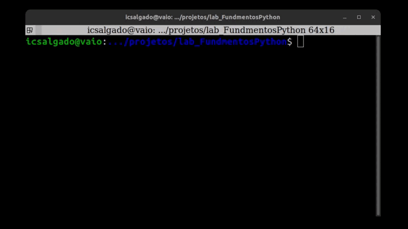

# Lab Project - Python Fundamentals

 <a href="https://www.dio.me/certificate/E0635200"> Project Certificate</a> -
<a href="https://www.dio.me/certificate/FD512AD1">Course Certificate</a> -
<a href="https://github.com/icsalgado/lab_FundmentosPython/blob/master/LabDesafioPyFundamentos.pdf" target="_blank">Challenge</a>

 

                    

## Goal

> The project proposal was a simple banking system with traditional operations and account limits. Improved handling of invalid entries and also a user-friendly terminal interface

### The Project

<a href="https://www.youtube.com/watch?v=RkZyyqnH760">Video on Youtube</a>

### References
https://dicasdepython.com.br/python-como-limpar-a-tela-do-console/

https://medium.com/cwi-software/como-definir-um-timeout-para-uma-fun%C3%A7%C3%A3o-em-python-22f74e3aa20c

https://fabiotavarespr.dev/posts/alterando-repositorios-git/

https://www.configuroweb.com/pt/como-colocar-video-de-youtube-en-el-archivo-readme-en-github/